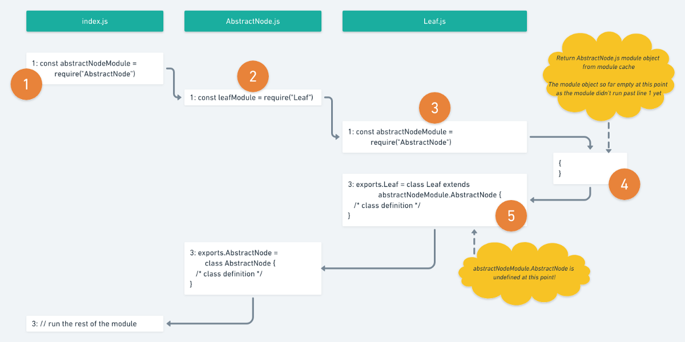
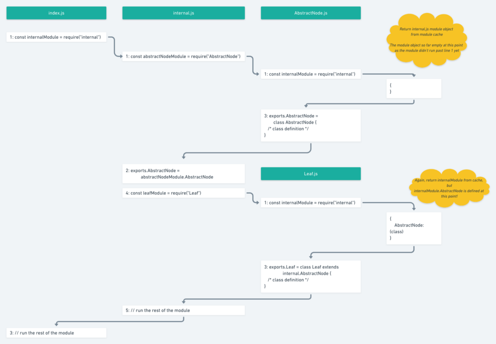

# nodejs 解决循坏依赖的思路

## 0. 前言

> 主要参考文章：[How to fix nasty circular dependency issues once and for all in JavaScript & TypeScript](https://medium.com/visual-development/how-to-fix-nasty-circular-dependency-issues-once-and-for-all-in-javascript-typescript-a04c987cf0de)(需要翻墙才能访问)

**注**：以下文中说的外文都是指上面参考的文章。

本文涉及的机器服务版本：

- nodejs版本：v10.7.0
- 系统版本：macOS Mojave v10.14.3
  - 处理器：2.5GHz Intel Core i7
  - 内存：16GB

之前对于nodejs中的循环依赖一知半解，看完上面的外文文章，加上自己亲身的实践，感觉对于nodejs的模块加载和循环依赖解决方案有了更深的理解。本文所有的代码都在同目录的code目录下。

在项目比较小的时候，普遍不会撞到循环依赖，大多数文件里代码都能集中放置在同个文件里头。（当然**将代码放在同个文件里面**也是外文中列举的解决方案之一，但不是我们今天要讨论的点）当项目越来越大时，代码拆分、模块化等是不得不做的事情，这时就可能会遇到循环依赖的问题了，特别是多人协作，你不清楚他人代码依赖的模块时。

## 1. 由案例引出问题

借用外文文章中的案例代码，该代码会以类似YAML语法来打印一棵对象树:


<center>图1.1</center>

大家可以运行**code**目录下的代码，我建议自己在本地搭建nodejs环境，方便深入分析时逐步debug使用。这个应用的实现很简单，一个基类`AbstractNode`，两个子类`Node`和`Leaf`。首先我们把这3个类放在同个文件里面（代码如`code/1/`所示）。

我们尝试拆分一下代码，把不同的类拆出来（代码如`code/2/`所示）。这时候运行`node index.js`时，就报`TypeError: Class extends value undefined is not a constructor or null`的错误了。

初步看代码，`index.js`依赖了`AbstractNode.js`，`AbstractNode.js`依赖了`Leaf.js`，而`Leaf.js`又依赖了`AbstractNode.js`，这时就发现形成了环，发生了循环依赖了。外文中有张图形象地描述了当发生循环依赖时，nodejs内部的情况。



<center>图1.2</center>

当如果不清楚nodejs模块加载的细节，看图也会云里雾里的。但现在不急着看nodejs模块加载的源代码。先看看解决方案。

## 2. 巧妙的解决方案

在外文中提出了一种模式（The internal module pattern)。将公共依赖的文件导入到一个internal的内部模块之中，其他的文件再从internal中引入自己需要的模块。需要注意的是**在internal里面，外部模块的依赖顺序决定导入顺序**。例如，在本文的代码中，`AbastrctNode`是基类，是被其他文件依赖的，所以先导入`AbastrctNode.js`文件。

根据这个模式我们再改造一个我们的代码，`code/3/`中所示。这时代码又能跑起来了。外文给了一张图片解释了为什么这种模式能够解决出现的问题：


<center>图2.1</center>

## 3. 如何解决的？

这里是通过vscode的debug能力，逐步调试进入到nodejs源码中，借此看看内部源码的实现。当然也可以通过github上的node源码来看，但难度会大一点。

其实我个人的理解中，这个模式解决循环依赖问题的关键在于以下两点：

- nodejs模块系统的**缓存机制**
- js语言的 call-by-sharing 的内存结构

### 3.1. 解析源码

现在我们就源码来解释internal module模式为什么能够解决循环依赖的问题的。

```javascript
// 下面所列的代码均在 node/lib/internal/modules/esm/loader.js 中
Module._load = function(request, parent, isMain) { // 这是require模块时负责装载模块的主要代码
  if (parent) {
    debug('Module._load REQUEST %s parent: %s', request, parent.id);
  }

  var filename = Module._resolveFilename(request, parent, isMain);

  // 查看是否是已经加载过（缓存）的模块，
  // 如果已经加载过的，则不需要重新编译。这是模块系统提升效率的方式。
  var cachedModule = Module._cache[filename];  
  if (cachedModule) {
    updateChildren(parent, cachedModule, true);
    return cachedModule.exports;
  }

  // 这里判断是否是内部模块，例如fs, net等
  if (NativeModule.nonInternalExists(filename)) {
    debug('load native module %s', request);
    return NativeModule.require(filename);
  }

  // Don't call updateChildren(), Module constructor already does.
  var module = new Module(filename, parent);

  if (isMain) {
    process.mainModule = module;
    module.id = '.';
  }
  
  // nodejs的模块系统会缓存已经加载的模块，这是解决循环依赖的关键
  Module._cache[filename] = module;
  // 在这里尝试加载模块
  tryModuleLoad(module, filename);

  return module.exports;
};

function tryModuleLoad(module, filename) {
  var threw = true;
  try {
    // 这里加载模块
    module.load(filename);
    threw = false;
  } finally {
    if (threw) {
      // 如果加载过程（包括编译过程）中发生错误。则把模块缓存删除。
      // 在debug的时候会发现莫名其妙就会跳转到这边来，大概率是因为编译文件出现问题，
      // 被nodejs内部try...catch到了。
      delete Module._cache[filename];
    }
  }
}

// ...

Module.prototype.load = function(filename) {
  debug('load %j for module %j', filename, this.id);

  assert(!this.loaded);
  this.filename = filename;
  this.paths = Module._nodeModulePaths(path.dirname(filename));

  var extension = path.extname(filename) || '.js';
  if (!Module._extensions[extension]) extension = '.js';
  // 根据文件不同的后缀名，需要用不同的加载器
  // 在loader.js文件中提供了以下几种加载器
  // Module._extensions['.js']
  // Module._extensions['.json']
  // Module._extensions['.node']
  // Module._extensions['.mjs']
  Module._extensions[extension](this, filename);
  this.loaded = true;

  // 这里根据--experimentalModules的flag来解析es6中的import & export语句
  // 需要注意的是，es6的import & export是异步的操作，分析过程会稍复杂点，
  // 这部分我还未分析，但总体来说效果和commonjs的模块系统一致。

  // 配合Module._extensions['.mjs']加载器使其支持es6的export和import
  if (experimentalModules) {
    if (asyncESM === undefined) lazyLoadESM();
    const ESMLoader = asyncESM.ESMLoader;
    const url = getURLFromFilePath(filename);
    const urlString = `${url}`;
    const exports = this.exports;
    if (ESMLoader.moduleMap.has(urlString) !== true) {
      ESMLoader.moduleMap.set(
        urlString,
        new ModuleJob(ESMLoader, url, async () => {
          const ctx = createDynamicModule(
            ['default'], url);
          ctx.reflect.exports.default.set(exports);
          return ctx;
        })
      );
    } else {
      const job = ESMLoader.moduleMap.get(urlString);
      if (job.reflect)
        job.reflect.exports.default.set(exports);
    }
  }
};
```

### 3.2. call by sharing

根据[维基百科的解释](https://en.wikipedia.org/wiki/Evaluation_strategy#Call_by_sharing)。
> Call by sharing (also referred to as call by object or call by object-sharing) is an evaluation strategy first named by Barbara Liskov et al. for the language CLU in 1974.[6] It is used by languages such as Python,[7] Iota,[8] Java (for object references), Ruby, JavaScript, Scheme, OCaml, AppleScript, and many others. However, the term "call by sharing" is not in common use; the terminology is inconsistent across different sources. For example, in the Java community, they say that Java is call by value.[9] Call by sharing implies that values in the language are based on objects rather than primitive types, i.e. that all values are "boxed". Can be said to pass by copy of reference(where primitives are boxed before passing and unboxed at called function).
> Mutations of a mutable object within the function are visible to the caller because the object is not copied or cloned — it is shared.

关于javascript的文章可以参考[Learning JavaScript: Call By Sharing, Parameter Passing](https://blog.bitsrc.io/master-javascript-call-by-sharing-parameter-passing-7049d65163ed)（需要翻墙）。

简单来说，**call-by-sharing传递的是对象引用的副本。当改动函数形参时，不会影响实参；如果修改的是形参对象的属性值，就会影响到实参。**

```javascript
function sum(num1) {
    num1 = { number:30 }
}
let n = { number:90 }
sum(n)
// `n` remains `{ number:90 }`
```

### 3.3. 汇总

了解了3.1和3.2后，我们再来回顾一下外文提供的两张图——图1.2和图2.1。

图1.2中比较好理解，结合3.1.中的源码，

1. `index.js`引用`AbstrctNode`，这时`AbstractNode`模块被缓存到cache中（但`AbstractNode.exports={}`），然后尝试解析`AbstractNode`模块。
2. 开始解析`AbstractNode`模块。`AbstractNode`模块中引入`Leaf`模块，这时`Leaf`模块被缓存到cache中，然后尝试解析`Leaf`模块。
3. 开始解析`Leaf`模块。`Leaf`模块中引入`AbstractNode`模块，这时cache中已经有`AbstractNode`模块的缓存了，就不需要再解析。然而这时`AbstractNode`模块的`exports`是个控对象，从`{}`中取出`AbstractNode`类是`undefined`，所以报了`TypeError: Class extends value undefined is not a constructor or null`的问题。

图2.1中，同样结合3.1.中的源码，

1. `index.js`引用`internal`模块，这时`internal`模块被缓存到cache中（但`internal.exports={}`），然后尝试解析`internal`模块。
2. 开始解析`internal`模块。`internal`引用`AbstrctNode`模块，`AbstrctNode`模块被缓存到cache中（但`AbstrctNode.exports={}`），然后尝试解析`AbstrctNode`模块。
3. 开始解析`AbstractNode`模块。`AbstractNode`模块中引入`internal`模块，因为cache中已经有`internal`缓存，所以继续解析`AbstractNode`模块。可以注意到的点是，`AbstractNode`中是用`const all = require('./internal');`来引入`internal`模块的整个`exports`对象，这就用到了js语言的**call by sharing**。尽管先引入了整个exports空对象（对象内存空间的引用的副本），但这时候并没有用到空对象里面的属性，而随着后面的解析，对象内就会有属性了，所以后续使用`exports`对象内的属性时就有值了（但这也是个缺陷，参考3.4.）。而如果直接用`const Node = require('./internal').Node;`的方式引入`Node`模块的话，这时候`internal.exports = {}`，`{}.Node === undefined`，所以还是会报`TypeError: Class extends value undefined is not a constructor or null`的问题。

### 3.4. internal模式缺陷

在3.3.中，需要注意到的是，尽管这个模式能解决循环依赖，但是有前提条件的

```javascript
// AbstractNode.js
const all = require('./internal'); // 这里引入internal模块后，里面的内容需要延后使用
console.log(all); // 因为该文件没解析完前，all都是个空对象
let test = new all.Leaf({}, {}); // 如果马上使用，会报TypeError: xxx is not a constructor 的错误
```

参考：
- [Learning JavaScript: Call By Sharing, Parameter Passing](https://blog.bitsrc.io/master-javascript-call-by-sharing-parameter-passing-7049d65163ed)
- [Evaluation strategy (wikipedia)](https://en.wikipedia.org/wiki/Evaluation_strategy#Call_by_sharing)
- [How to fix nasty circular dependency issues once and for all in JavaScript & TypeScript](https://medium.com/visual-development/how-to-fix-nasty-circular-dependency-issues-once-and-for-all-in-javascript-typescript-a04c987cf0de)
- [Does call-by-sharing and call-by-reference differ only while multithreading?](https://stackoverflow.com/questions/13899171/does-call-by-sharing-and-call-by-reference-differ-only-while-multithreading)
- [Call by Sharing](http://www.pmg.lcs.mit.edu/papers/thetaref/node34.html)